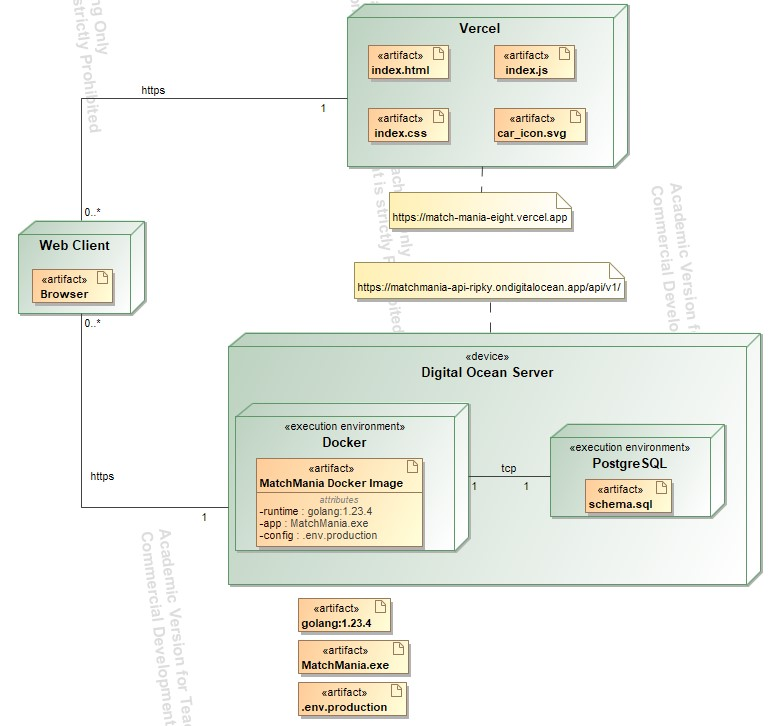
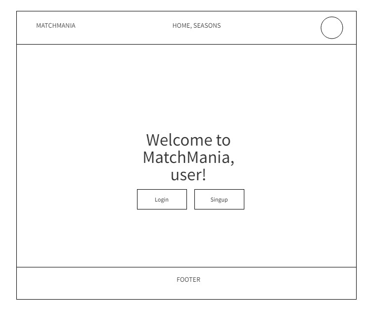
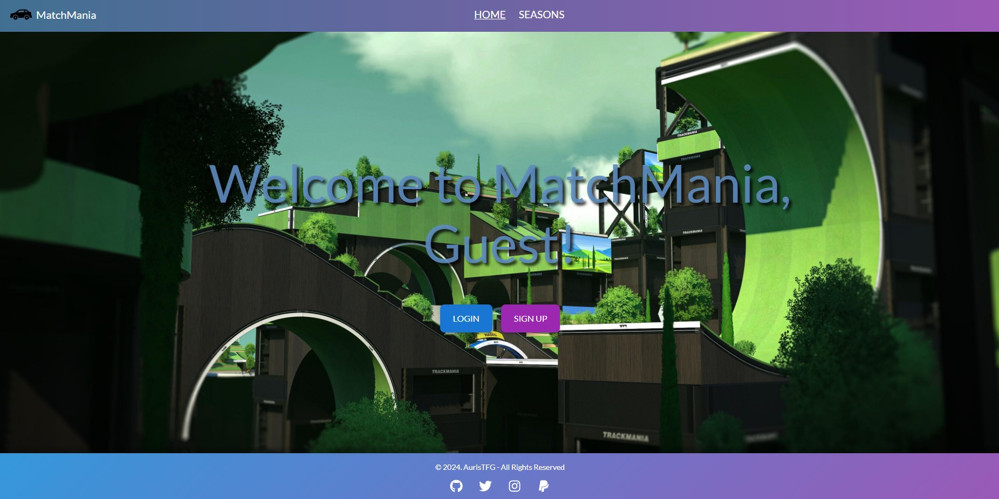
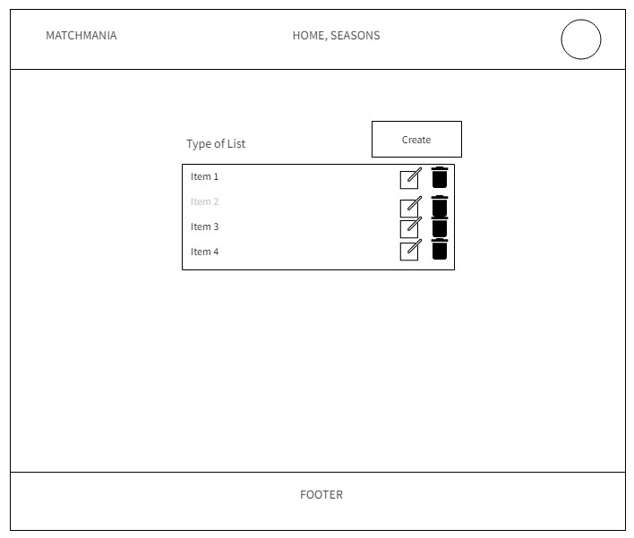
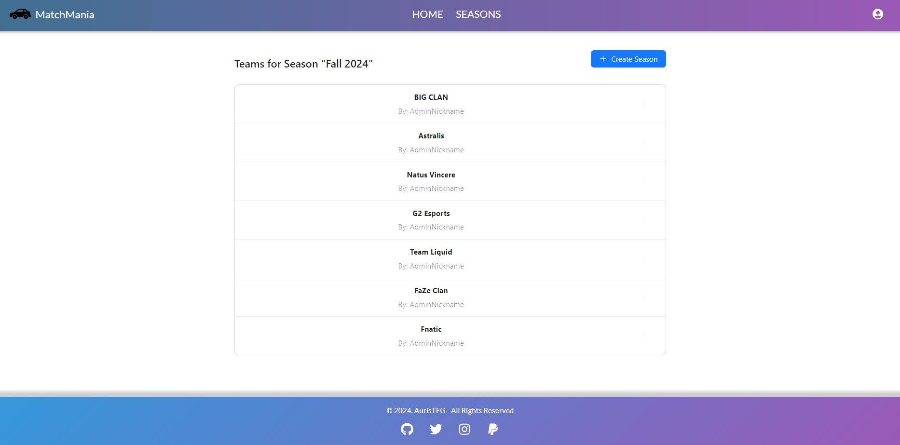

# MatchMania

**A competitive matchmaking app for the racing game Trackmania**, developed as a university project.

## Purpose

The purpose of **MatchMania** is to offer a dynamic and fair matchmaking experience for Trackmania players. By utilizing an **ELO-based ranking system**, it matches players of similar skill levels, ensuring balanced competition and enhancing player engagement.

## Functional Requirements

- **ELO Ranking System**: Tracks player performance and adjusts rankings based on match outcomes. Players are ranked according to their skill level, with the system continuously recalibrating after every match.
- **User Registration**: Players can create an account, log in, and maintain a secure profile.
- **Season Creation**: Users can create multiple seasons, each with its own ELO ranking system, providing a fresh start for each competitive period.
- **Team Registration**: Users can form teams to compete together in season-based or individual competitions.
- **Matchmaking**: Players are paired with others of similar skill levels, with support for both **team-based** and **individual** match types.
- **Results Submission**: After completing a match, players can submit their results, which directly impact the ELO rankings.
- **User Profiles**: Players have personalized profiles displaying their statistics, match history, and overall rankings, allowing them to track their progress and achievements.

## Technologies Used

### General

- **Makefile**: Automation of build, run, and other tasks.
- **Dockerfile**: Containerization of the app for consistent environments.

### Frontend

- **pnpm**: Fast and efficient package manager.
- **Vite**: Next-generation frontend build tool for fast development and optimized production builds.
- **React + TypeScript + SWC**: Type-safe React development with SWC for fast JSX/TypeScript compilation.

### Backend

- **Go + Gin + GORM**: Go programming language with the Gin framework and GORM for easy database interaction.
- **JWT**: JSON Web Tokens for secure authentication and user session management.
- **PostgreSQL**: Relational database management system for storing user data, match results, and rankings.

## Deployment Diagram

## Documentation

Swagger documentation for the API can be accessed at:  
[https://matchmania-api-ripky.ondigitalocean.app/swagger/index.html#/](https://matchmania-api-ripky.ondigitalocean.app/swagger/index.html#/)

Additionally, the OpenAPI specification is available at:  
[backend/docs/swagger.yaml](../backend/docs/swagger.yaml)

## How to Run

1. **Clone the repository**:  
   `git clone https://github.com/your-username/matchmania.git`

2. **Backend**:

   - Navigate to the `backend` directory:  
     `cd backend`
   - Run the app using the Makefile:  
     `make run`

3. **Frontend**:

   - Navigate to the `frontend` directory:  
     `cd frontend`
   - Run the app using the Makefile:  
     `make run`

4. For more commands, simply run:  
   `make help`

The **Makefile** makes the setup and running process easier, automating most tasks.

## User Interface Design

### Home Page

  
_Wireframe for the homepage with navigation and key features._

  
_Actual screenshot of the homepage UI._

### Models Page

  
_Wireframe for the seasons or teams or results page, showing available items and information about them._

  
_Actual screenshot of the teams page with teams details._

## Conclusions

In conclusion, **MatchMania** did not fully meet the expectations set at the beginning of this course. While the core CRUD operations for the three main models function as expected, the project lacks additional features and depth that were initially anticipated.
